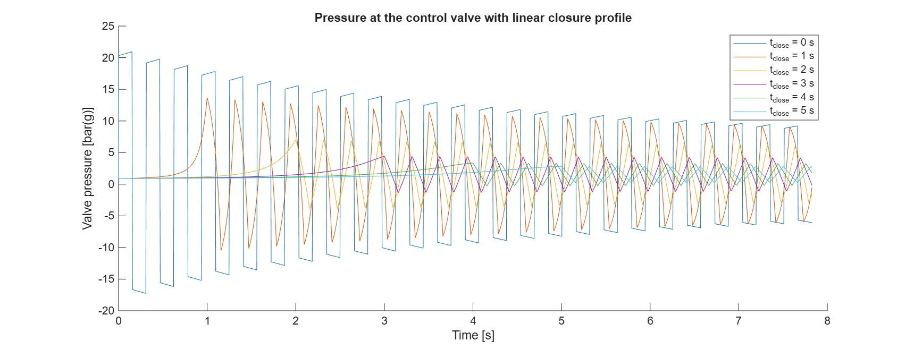

# pipeline-surge-matlab

This project studies valve-closure surge in a representative industrial cooling-water line. The engineering objective is to determine the shortest linear valve-closing time that limits the pressure rise while keeping the entire line above the water vapour-pressure threshold. The case is synthetic but physically plausible: a 100 m commercial-steel DN 300 line carries approximately 400 m³/h from a centrifugal pump to a fixed-head receiving system through a heat exchanger, fittings and a downstream control valve.

The steady operating point is obtained with core MATLAB `fzero` from the intersection of representative pump and system curves. The system curve includes the receiving-side head, pipe friction, heat-exchanger losses, fittings and the fully open control valve. This operating flow and its corresponding head distribution initialize a reservoir-pipe-valve Method-of-Characteristics model.

The transient solver uses an elastic wave speed, quasi-steady Darcy friction, a constant upstream head and a valve boundary whose effective capacity follows a prescribed linear closing law. A Courant number of one aligns the numerical grid with the characteristic wave paths. The first pressure rise for instantaneous closure is checked against the Joukowsky prediction before the practical closing times are compared.

Several linear closing times are compared using valve-inlet pressure histories, spatial pressure envelopes, vapour-pressure margin and thin-wall hoop-stress screening. For the assumed line, closures of 0–3 s cause the single-phase solution to cross the water vapour-pressure threshold. A 4 s linear closure is the shortest tested case retaining a positive vapour-pressure margin, while 5 s provides only a modest additional pressure reduction. Sub-vapour single-phase results are cavitation-onset indicators rather than physical pressure predictions; modelling column separation would require a cavitation-capable formulation.

Run `run_analysis.m` with `moc_solver.m` in the same directory. The project uses core MATLAB only and requires no additional toolbox. The Live Script contains the narrated presentation of the study, while the plain `.m` file is the clean, GitHub-readable implementation.

## Files

- `run_analysis.m` — complete code-only steady and transient analysis
- `analysis_valve_timing.mlx` — narrated MATLAB Live Script
- `moc_solver.m` — reservoir-pipe-valve MOC solver
- `valve_pressure_history.jpg` — principal comparison figure
- `LICENSE` — MIT license

The model is intended for transparent engineering screening, not final system design. It assumes a horizontal single pipe, constant fluid properties, a fixed wave speed, quasi-steady friction, no reverse flow through the valve and no vapour-cavity dynamics.
